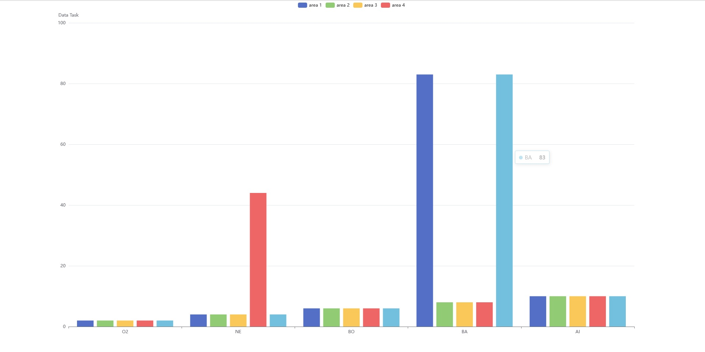
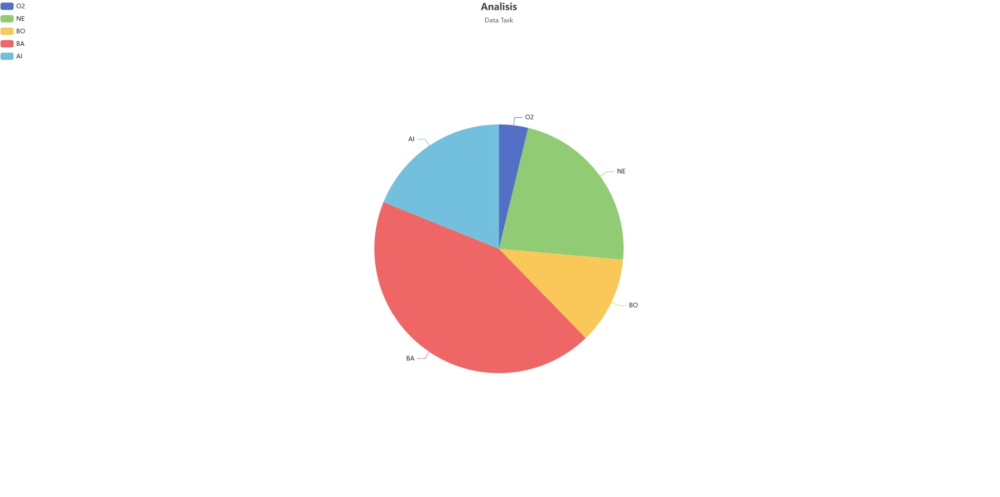

diagram Bar

url = http://127.0.0.1:8000/bar

diagram pie

url = http://127.0.0.1:8000/pie

instalasi

-cp .env.example dan rename menjadi .env lalu setting database

-composer update

-php artisan key:generate

-php artisan migrate:fresh --seed

-php artisan serve
